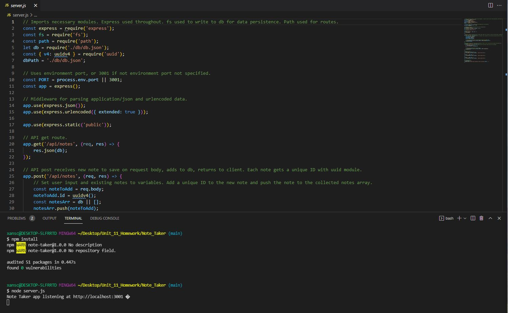
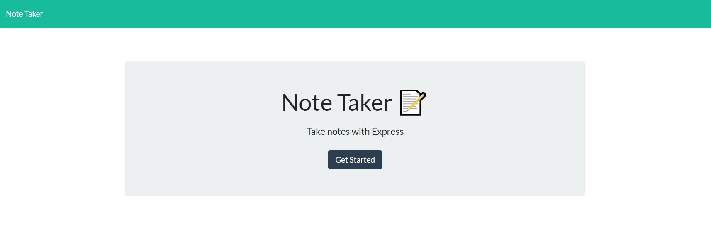
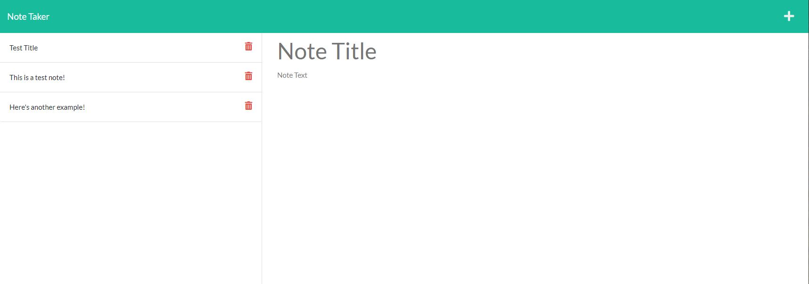
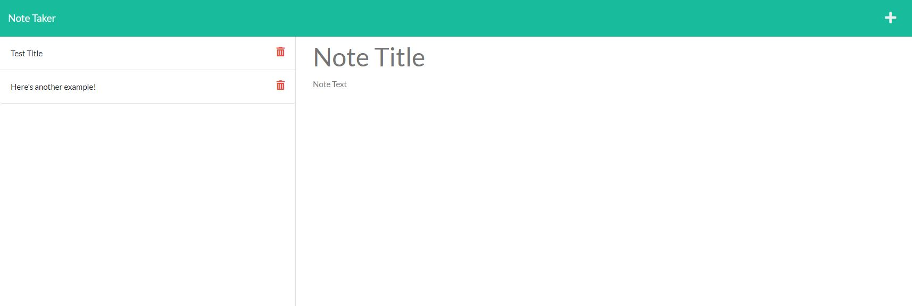

# Note_Taker

## Description

This project uses node.js with inquirer to ask the user a variety of questions regarding their project. It then uses that input to generate a string in the Markdown syntax that is written to a ReadMe.md file for use in their repository.

This is a full stack app. It takes user input to receive notes to be saved and displayed, and has the option to delete them as well. Notes are persistently stored on the back end with a generated unique ID. Express, fs, path, and uuid facilitate this.

## Table of Contents

1. [Description](#description)
2. [Installation](#installation)
3. [Usage](#usage)
4. [License](#license)
5. [Contributing](#contributing)
6. [Tests](#tests)
7. [Questions](#questions)

## Installation

First you need to fork, then clone, the repository to your local, and make sure you're ready to use node.js. After doing so, open the integrated terminal in the Note_Taker directory and in the command line enter "npm install" to install the necessary dependancies.

## Usage

After installation is complete, enter "node server.js" in the integrated terminal you should still have open, in the directory you cloned to. This will run the app, and the port the app is listening to will be displayed. Navigating to the displayed port will bring up the app's front end. First will be a landing page. Clicking on the "Get Started" button will take you to the notes page. On this page you will see fields for user input with placeholder text of "Note Title" and "Note Text" for their respective fields. On the left will be displayed any persistent notes. Upon entering input a save button will appear in the upper right, pressing it will save and display the entered note. Next to the persistent notes are delete icons, pressing those will delete the accompanying note from the display and saved database. Examples of these can be seen below.

## License

The license under which this project is covered is the MIT License. Learn more about that license [here](https://choosealicense.com/licenses/mit/).
